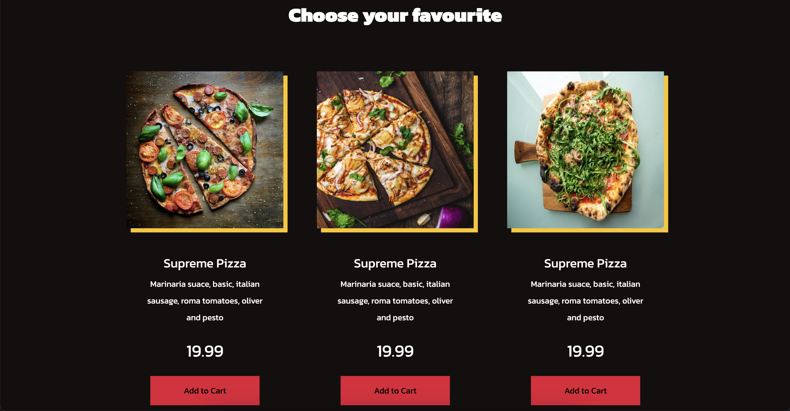

# Web-based Pizza Ordering

## Description

Web-based Pizza Ordering is a test project designed to showcase simple but functional ordering system with a focus on frontend.

## Getting started

To set up and run the project on your local machine, follow these steps:

### 1. Clone the project repository to your local environment.

### 2. `npm install`
Install all project dependencies required to bundle the app.

### 3. `npm start`
Run the app in the development mode
Open [http://localhost:3000](http://localhost:3000) to view it in the browser.
The page will reload if you make edits. You will also see any lint errors in the console.

## Demo

## Acknowledgments
This website was inspired by a [tutorial on YouTube](https://www.youtube.com/watch?v=1awiPrGcqqI&ab_channel=LightCode). Special thanks to the tutorial creator for providing valuable guidance and insights.

